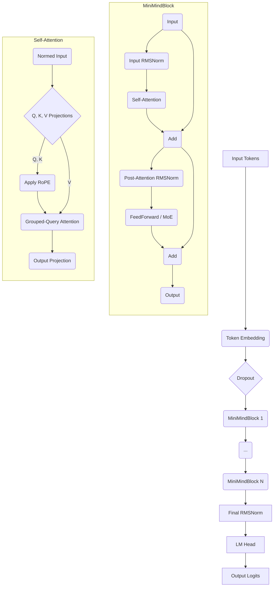

# MiniMind 模型架构深度解析

本文档旨在深入剖析 `MiniMind` 模型的内部架构和核心组件。通过架构示意图和详细的代码模块说明，帮助开发者和研究者快速理解其设计理念和实现细节。

## 1. 整体架构示意图

`MiniMind` 采用的是现代主流的 **Decoder-Only Transformer** 架构，与 Llama 等先进模型的设计思想保持一致。其核心特点是高效、可扩展，并集成了多种优化技术。

*（注意：此为 Mermaid 格式的流程图，可在支持 Mermaid 的 Markdown 编辑器中渲染为图形）*

**数据流说明:**
1.  **输入 (Input Tokens):** 模型的输入是经过 Tokenizer 处理的数字 ID 序列。
2.  **词嵌入 (Token Embedding):** ID 序列通过 `embed_tokens` 层转换为密集的向量表示（Embedding）。
3.  **Transformer 层堆叠 (MiniMindBlock x N):** 嵌入向量依次通过 N 个相同的 `MiniMindBlock`（Transformer 层）。这是模型的核心部分，负责信息的处理和抽象。
4.  **最终归一化 (Final RMSNorm):** 经过所有 Transformer 层后，输出的向量会再通过一个 `RMSNorm` 层。
5.  **语言模型头 (LM Head):** 归一化后的向量被送入一个线性层 (`lm_head`)，该层将向量映射到词汇表大小的维度，生成预测每个 Token 的 Logits。
6.  **输出 (Output Logits):** Logits 代表了词汇表中每个词在下一个位置出现的原始分数。

---

## 2. 核心组件详解

以下是对 `model/model_minimind.py` 中每个关键类的详细说明。

### 2.1 `MiniMindConfig`
这是模型的配置中心，继承自 Hugging Face 的 `PretrainedConfig`。它统一管理模型的所有超参数，包括：
- **基本架构参数:** `hidden_size`, `num_hidden_layers`, `num_attention_heads`, `vocab_size` 等。
- **性能优化参数:**
    - `num_key_value_heads`: 用于实现分组查询注意力 (GQA)。
    - `hidden_act`: 激活函数类型，默认为 `silu` (SwiGLU)。
    - `flash_attn`: 是否启用 Flash Attention。
- **位置编码参数:** `rope_theta`, `inference_rope_scaling` (用于 YaRN 长度外推)。
- **MoE 相关参数:** 当 `use_moe=True` 时，用于配置混合专家模块，如 `num_experts_per_tok` (每个 Token 选择的专家数) 和 `n_routed_experts` (总专家数)。

### 2.2 `RMSNorm`
**功能:** 实现 Root Mean Square Layer Normalization。
**作用:** 代替传统的 LayerNorm，在保持性能的同时减少了计算量。它通过对向量的平方和求均值再开方来进行归一化，然后乘以一个可学习的 `weight` 参数。这是 Llama 系列模型广泛采用的归一化技术。

### 2.3 `Attention` (自注意力模块)
这是 Transformer 的核心，负责捕捉序列中不同 Token 之间的关系。
- **分组查询注意力 (GQA):** 通过设置 `num_key_value_heads` < `num_attention_heads` 实现。多个查询头（Query Head）可以共享同一组键值头（Key/Value Head），在几乎不损失性能的情况下，显著减少了 KV 缓存的大小和计算量，从而提升了推理速度。`repeat_kv` 函数负责将 K/V 头重复，以匹配 Q 头的数量。
- **旋转位置编码 (RoPE):** 模型没有使用绝对或相对位置编码，而是采用了 RoPE。它通过在 Attention 计算前，将位置信息以旋转矩阵的形式"乘"到 Query 和 Key 向量上，从而注入了相对位置信息。`precompute_freqs_cis` 函数用于预计算不同位置的旋转矩阵（cos 和 sin 值），`apply_rotary_pos_emb` 则执行具体的旋转操作。
- **Flash Attention:** 当条件满足时（PyTorch >= 2.0），模型会调用 `F.scaled_dot_product_attention`，这是一个高度优化的内核，能显著加速 Attention 计算并节省显存。如果条件不满足，则回退到手动的 Attention 实现。
- **KV 缓存:** 在推理（生成）模式下，`past_key_value` 用于存储已经计算过的 Key 和 Value，避免在生成每个新 Token 时重复计算，极大地提高了生成效率。

### 2.4 `FeedForward` (前馈网络)
**功能:** 为模型提供非线性处理能力。
**实现:** 采用了 **SwiGLU** (Swish Gated Linear Unit) 激活函数，其计算公式为 `(Swish(gate_proj(x)) * up_proj(x))`。相较于传统的 ReLU，SwiGLU 被证明能提供更好的性能。

### 2.5 `MOEFeedForward` & `MoEGate` (混合专家模块)
当 `use_moe=True` 时，此模块会替代标准的 `FeedForward`。
- **`MoEGate` (门控/路由器):**
    - 它的作用是为每个输入的 Token 动态地选择最合适的专家（Expert）。
    - 它通过一个线性层计算每个专家的得分（`logits`），然后通过 `softmax` 得到权重。
    - `torch.topk` 用于选出权重最高的 `num_experts_per_tok` 个专家。
    - **辅助损失 (Auxiliary Loss):** 为了防止所有 Token 都涌向少数几个“明星专家”，导致训练不均衡，门控网络会计算一个辅助损失，鼓励负载在所有专家之间均匀分布。
- **`MOEFeedForward`:**
    - 内部包含一个 `MoEGate` 和一个由多个标准 `FeedForward` 组成的专家列表 (`self.experts`)。
    - 在前向传播时，它首先通过门控为每个 Token 选择专家并计算权重，然后将 Token 的向量表示路由到对应的专家网络中进行计算。
    - 最终的输出是所有被选中专家输出的加权和。
    - **推理优化 (`moe_infer`):** 推理时，为了提高效率，它会对 Token 进行重排，将发往同一个专家的 Token 组合在一起进行批处理，避免了稀疏计算带来的性能瓶颈。

### 2.6 `MiniMindBlock` (Transformer 核心构建块)
**功能:** 单个完整的 Transformer 层。
**结构 (Pre-Normalization):**
1.  **残差连接 1:** 输入首先经过 `input_layernorm` (RMSNorm)。
2.  **自注意力:** 归一化后的输出进入 `Attention` 模块。
3.  **Add:** `Attention` 的输出与该模块的原始输入相加（Add & Norm 的 "Add" 部分）。
4.  **残差连接 2:** 上一步的结果再经过 `post_attention_layernorm` (RMSNorm)。
5.  **前馈网络:** 归一化后的输出进入 `FeedForward` 或 `MOEFeedForward` 模块。
6.  **Add:** FFN/MoE 的输出与第二步的输入（即第一次残差相加后的结果）相加。

这个“先归一化再计算”的 Pre-Normalization 结构有助于稳定深度网络的训练。

### 2.7 `MiniMindModel` & `MiniMindForCausalLM`
- **`MiniMindModel`:**
    - 包含词嵌入层 (`embed_tokens`) 和一个由 N 个 `MiniMindBlock` 组成的列表 (`self.layers`)。
    - 它负责管理 RoPE 的预计算频率 (`freqs_cos`, `freqs_sin`)。
    - 完整地执行从 Token 输入到最终隐藏状态（Hidden States）的整个前向过程。
- **`MiniMindForCausalLM`:**
    - 在 `MiniMindModel` 的基础上封装了一层，使其成为一个完整的因果语言模型 (Causal LM)。
    - **添加 LM Head:** 增加了一个线性层 (`lm_head`)，用于将模型的最终输出向量转换为对整个词汇表的 Logits 预测。
    - **权重绑定:** `lm_head` 和 `embed_tokens` 的权重是共享的。这是一种常见的做法，可以减少模型参数量并提高性能。
    - **Hugging Face 兼容:** 继承自 `PreTrainedModel` 和 `GenerationMixin`，使其能够无缝接入 Hugging Face 生态，直接使用 `.from_pretrained()` 加载和 `.generate()` 进行文本生成。
