# MiniMind 模型架构分析

本文档详细分析了 MiniMind 项目中的核心架构组件，包括配置系统和 Transformer 层的实现。

---

## 1. MiniMindConfig 配置类分析

### 📋 整体架构

`MiniMindConfig` 继承自 `transformers.PretrainedConfig`，是整个 MiniMind 模型的配置中心，定义了模型的所有超参数和架构选项。

**源码位置**: [model_minimind.py:L8-L78](file:///Users/chenjp22/project/minimind/model/model_minimind.py#L8-L78)

### 🔧 参数分类

配置参数可以分为以下几个核心模块：

#### 1. 基础模型参数

| 参数 | 默认值 | 说明 |
|------|--------|------|
| `hidden_size` | 512 | 隐藏层维度，模型的核心维度 |
| `num_hidden_layers` | 8 | Transformer 层数 |
| `num_attention_heads` | 8 | 注意力头数量 |
| `num_key_value_heads` | 2 | KV 头数量，支持 GQA (Grouped Query Attention) |
| `vocab_size` | 6400 | 词表大小 |
| `intermediate_size` | None | FFN 中间层维度（自动计算为 hidden_size * 8/3） |
| `hidden_act` | 'silu' | 激活函数类型 |

#### 2. 位置编码参数

| 参数 | 默认值 | 说明 |
|------|--------|------|
| `max_position_embeddings` | 32768 | 最大序列长度 |
| `rope_theta` | 1000000.0 | RoPE 的基频参数 |
| `inference_rope_scaling` | False | 是否启用 YaRN 位置外推技术 |

**YaRN 位置外推**: 当启用时，使用 YaRN 算法扩展上下文长度至 16 倍 (2048 → 32768)

```python
self.rope_scaling = {
    "beta_fast": 32,
    "beta_slow": 1,
    "factor": 16,
    "original_max_position_embeddings": 2048,
    "attention_factor": 1.0,
    "type": "yarn"
} if self.inference_rope_scaling else None
```

#### 3. 训练与优化参数

| 参数 | 默认值 | 说明 |
|------|--------|------|
| `dropout` | 0.0 | Dropout 比率 |
| `rms_norm_eps` | 1e-05 | RMSNorm 的数值稳定性参数 |
| `flash_attn` | True | 是否使用 Flash Attention 加速 |
| `bos_token_id` | 1 | 句首 token ID |
| `eos_token_id` | 2 | 句尾 token ID |

#### 4. MoE (混合专家) 架构参数

这是该模型的**特色功能**，支持稀疏激活的专家混合架构：

| 参数 | 默认值 | 说明 |
|------|--------|------|
| `use_moe` | False | 是否启用 MoE |
| `n_routed_experts` | 4 | 可路由专家总数 |
| `n_shared_experts` | 1 | 共享专家数量（始终激活） |
| `num_experts_per_tok` | 2 | 每个 token 激活的专家数 |
| `scoring_func` | 'softmax' | 门控评分函数 |
| `aux_loss_alpha` | 0.01 | 负载均衡损失系数 |
| `seq_aux` | True | 是否在序列级别计算辅助损失 |
| `norm_topk_prob` | True | 是否归一化 top-k 概率 |

### 🔄 工作流程

```mermaid
graph TD
    A[初始化 MiniMindConfig] --> B{检查 use_moe}
    B -->|False| C[使用标准 FFN]
    B -->|True| D[使用 MOEFeedForward]
    
    A --> E{检查 inference_rope_scaling}
    E -->|True| F[配置 YaRN 位置外推]
    E -->|False| G[使用标准 RoPE]
    
    A --> H[传递给 MiniMindModel]
    H --> I[构建 Transformer Blocks]
    
    I --> J[Attention 层]
    I --> K{MLP 层选择}
    K -->|use_moe=False| L[FeedForward]
    K -->|use_moe=True| M[MOEFeedForward]
    
    M --> N[MoEGate 路由]
    N --> O[选择 top-k 专家]
    O --> P[计算辅助损失]
```



### 💡 关键设计亮点

1. **GQA 支持**: `num_key_value_heads` < `num_attention_heads` 实现分组查询注意力，减少 KV Cache 内存占用

2. **YaRN 位置外推**: 通过 `rope_scaling` 配置，支持将训练长度 2048 外推到推理长度 32768

3. **灵活的 MoE**:
   - 支持可路由专家 + 共享专家的混合架构
   - 内置负载均衡损失 (aux_loss) 防止专家崩塌
   - 支持序列级和 token 级的辅助损失计算

4. **模块化设计**: 所有参数都可通过配置文件或命令行参数灵活调整，无需修改代码

### 📊 典型配置示例

```python
# 标准配置 (26M 参数)
config = MiniMindConfig(
    hidden_size=512,
    num_hidden_layers=8,
    num_attention_heads=8,
    num_key_value_heads=2,  # GQA
    use_moe=False
)

# MoE 配置 (更高容量)
config_moe = MiniMindConfig(
    hidden_size=512,
    num_hidden_layers=8,
    use_moe=True,
    n_routed_experts=4,
    num_experts_per_tok=2  # 稀疏激活
)
```

---

## 2. MiniMindBlock Transformer 层分析

### 🏗️ 架构设计

`MiniMindBlock` 是单个 Transformer 层的实现，采用了现代 LLM 的标准 Pre-Norm 架构。

**源码位置**: [model_minimind.py:L353-L374](file:///Users/chenjp22/project/minimind/model/model_minimind.py#L353-L374)

```mermaid
graph TB
    Input[Input: hidden_states] --> LN1[RMSNorm 1<br/>input_layernorm]
    LN1 --> Attn[Self-Attention<br/>+ RoPE + KV Cache]
    Input --> Add1[残差连接 +]
    Attn --> Add1
    
    Add1 --> LN2[RMSNorm 2<br/>post_attention_layernorm]
    LN2 --> MLP{MLP 选择}
    MLP -->|use_moe=False| FFN[FeedForward<br/>标准 FFN]
    MLP -->|use_moe=True| MOE[MOEFeedForward<br/>混合专家]
    
    Add1 --> Add2[残差连接 +]
    FFN --> Add2
    MOE --> Add2
    
    Add2 --> Output[Output: hidden_states]
    
    Attn -.-> Cache[past_key_value<br/>present_key_value]
    
    style Input fill:#e1f5ff
    style Output fill:#e1f5ff
    style Attn fill:#fff4e1
    style MLP fill:#ffe1f5
    style Add1 fill:#e1ffe1
    style Add2 fill:#e1ffe1
```



### 📦 组件构成

#### 1. 注意力机制

```python
self.self_attn = Attention(config)
```

**特性**:

- 实现了 **GQA (Grouped Query Attention)**
- 支持 **RoPE** 位置编码
- 支持 **Flash Attention** 加速
- 支持 **KV Cache** 用于推理加速

#### 2. 归一化层

```python
self.input_layernorm = RMSNorm(config.hidden_size, eps=config.rms_norm_eps)
self.post_attention_layernorm = RMSNorm(config.hidden_size, eps=config.rms_norm_eps)
```

**特性**:

- 使用 **RMSNorm** 而非 LayerNorm（更高效，LLaMA 同款）
- **Pre-Norm** 架构：归一化在子层之前，训练更稳定

#### 3. 前馈网络 (动态选择)

```python
self.mlp = FeedForward(config) if not config.use_moe else MOEFeedForward(config)
```

**模式**:

- **标准模式**: `FeedForward` - SwiGLU 激活的 FFN
- **MoE 模式**: `MOEFeedForward` - 稀疏激活的专家混合网络

### 🔄 前向传播流程

#### 完整数据流

```python
def forward(self, hidden_states, position_embeddings, past_key_value=None, 
            use_cache=False, attention_mask=None):
    # 步骤 1: Attention 子层 (Pre-Norm + Residual)
    residual = hidden_states                                    # 保存残差
    hidden_states, present_key_value = self.self_attn(
        self.input_layernorm(hidden_states),                   # Pre-Norm
        position_embeddings,                                    # RoPE cos/sin
        past_key_value,                                         # KV Cache (推理时)
        use_cache,                                              # 是否返回新的 KV
        attention_mask                                          # Padding mask
    )
    hidden_states += residual                                   # 残差连接
    
    # 步骤 2: MLP 子层 (Pre-Norm + Residual)
    hidden_states = hidden_states + self.mlp(
        self.post_attention_layernorm(hidden_states)           # Pre-Norm
    )
    
    return hidden_states, present_key_value
```

#### 逐步解析

| 步骤 | 操作 | 输入形状 | 输出形状 | 说明 |
|------|------|----------|----------|------|
| 1 | `residual = hidden_states` | `[B, L, H]` | `[B, L, H]` | 保存原始输入用于残差 |
| 2 | `input_layernorm(...)` | `[B, L, H]` | `[B, L, H]` | RMSNorm 归一化 |
| 3 | `self_attn(...)` | `[B, L, H]` | `[B, L, H]` | 多头自注意力 + RoPE |
| 4 | `+= residual` | `[B, L, H]` | `[B, L, H]` | **第一个残差连接** |
| 5 | `post_attention_layernorm(...)` | `[B, L, H]` | `[B, L, H]` | RMSNorm 归一化 |
| 6 | `mlp(...)` | `[B, L, H]` | `[B, L, H]` | FFN 或 MoE |
| 7 | `+= ...` | `[B, L, H]` | `[B, L, H]` | **第二个残差连接** |

> **注**: `B` = batch_size, `L` = seq_len, `H` = hidden_size

### 🎯 关键设计特点

#### 1. Pre-Norm 架构

```
传统 Post-Norm:  X → SubLayer → Norm → + Residual
现代 Pre-Norm:   X → Norm → SubLayer → + Residual  ✅
```

**优势**:

- 梯度流更稳定，训练更容易
- 无需 Warmup 也能训练
- LLaMA、GPT-3 等现代模型的标准选择

#### 2. 双残差连接

```python
# 第一个残差: Attention 分支
hidden_states += residual

# 第二个残差: MLP 分支  
hidden_states = hidden_states + self.mlp(...)
```

**作用**:

- 确保梯度能直接回传到输入层
- 缓解深层网络的梯度消失问题

#### 3. KV Cache 机制

```python
hidden_states, present_key_value = self.self_attn(
    ..., past_key_value, use_cache, ...
)
```

**使用场景**:

- **训练时**: `use_cache=False`, `past_key_value=None`
- **推理时**: `use_cache=True`, 复用之前的 Key/Value
- **加速效果**: 推理复杂度从 O(n²) 降至 O(n)

#### 4. 灵活的 MLP 选择

```python
# 根据配置动态选择
self.mlp = FeedForward(config) if not config.use_moe else MOEFeedForward(config)
```

**对比**:

- **密集模型**: 所有参数都激活
- **稀疏 MoE**: 只激活部分专家，提高参数效率

### 📊 计算复杂度分析

假设 `hidden_size=512`, `seq_len=L`:

| 组件 | 参数量 | 计算复杂度 |
|------|--------|-----------|
| **Attention** | ~1.0M | O(L² × H) |
| **FFN** | ~1.3M | O(L × H²) |
| **RMSNorm** | 1K | O(L × H) |
| **总计/层** | ~2.3M | O(L² × H + L × H²) |

### 💡 与经典 Transformer 的对比

| 特性 | 经典 Transformer | MiniMindBlock |
|------|-----------------|---------------|
| 归一化 | LayerNorm | **RMSNorm** (更快) |
| 归一化位置 | Post-Norm | **Pre-Norm** (更稳定) |
| 位置编码 | 绝对位置编码 | **RoPE** (相对位置) |
| Attention | MHA | **GQA** (省内存) |
| FFN | 标准 FFN | **SwiGLU + MoE** (可选) |
| 加速 | 无 | **Flash Attention** |

### 🔧 使用示例

```python
# 创建单个 Transformer 层
config = MiniMindConfig(hidden_size=512, num_attention_heads=8)
block = MiniMindBlock(layer_id=0, config=config)

# 前向传播
hidden_states = torch.randn(2, 128, 512)  # [batch, seq_len, hidden]
position_embeddings = (cos, sin)           # RoPE 编码

output, kv_cache = block(
    hidden_states=hidden_states,
    position_embeddings=position_embeddings,
    use_cache=True  # 推理时启用
)
```

---

## 总结

MiniMind 的架构设计体现了现代 LLM 的最佳实践：

1. **高效的注意力机制**: GQA + Flash Attention + KV Cache
2. **稳定的训练**: Pre-Norm + RMSNorm + 残差连接
3. **灵活的扩展性**: 支持标准 FFN 和 MoE 两种模式
4. **先进的位置编码**: RoPE + YaRN 外推技术

这些设计使得 MiniMind 能够在极小的参数量（26M）下实现良好的性能，是学习和理解现代 Transformer 架构的优秀案例。
